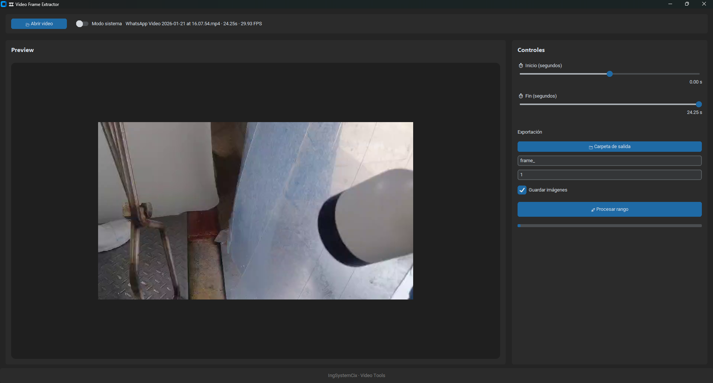

# 🎞 Video Frame Extractor

Una aplicación de escritorio moderna e intuitiva para extraer fotogramas de videos con precisión de segundo. Herramienta profesional desarrollada con interfaz gráfica mejorada para procesamiento eficiente de contenido audiovisual.

**Versión:** 1.1.0 | **Última actualización:** 26 de enero de 2026



---

## 📋 Características

- ✅ **Interfaz gráfica moderna** - Diseño dark mode intuitivo basado en CustomTkinter
- 🎬 **Soporte multi-formato** - MP4, AVI, MKV, MOV
- ⏱️ **Control preciso de tiempo** - Sliders interactivos para definir rango de extracción
- 👁️ **Preview en tiempo real** - Visualización instantánea de fotogramas seleccionados
- 📊 **Barra de progreso** - Monitoreo en vivo del procesamiento
- 🔧 **Configuración flexible** - Prefijo de nombre, índice inicial, carpeta de salida personalizable
- 💾 **Exportación en PNG** - Fotogramas de alta calidad sin compresión
- 🔄 **Procesamiento asíncrono** - No bloquea la interfaz durante la extracción
- 🌓 **Modo sistema** - Toggle entre tema claro y oscuro

---

## 🛠️ Requisitos del Sistema

- **Python:** 3.8 o superior
- **SO:** Windows, macOS, Linux
- **RAM:** 4 GB mínima (recomendada 8 GB para videos 4K)
- **Espacio disco:** Variable según cantidad de fotogramas

---

## 📖 Guía de Uso

### Paso 1: Cargar un video
1. Haz clic en el botón **"📂 Abrir video"**
2. Selecciona un archivo de video compatible (MP4, AVI, MKV, MOV)
3. La duración y datos técnicos aparecerán en la barra de información

### Paso 2: Definir rango de extracción
1. Usa el slider **"⏱ Inicio"** para establecer el segundo inicial
2. Usa el slider **"⏱ Fin"** para establecer el segundo final
3. El preview se actualiza en tiempo real para cada punto

### Paso 3: Configurar parámetros de exportación
| Parámetro | Descripción |
|-----------|-------------|
| **📁 Carpeta de salida** | Directorio donde se guardarán los PNG |
| **Prefijo** | Nombre base para los fotogramas (por defecto: `frame_`) |
| **Índice inicial** | Número de inicio para la numeración (por defecto: `1`) |
| **Guardar imágenes** | Checkbox para habilitar/deshabilitar guardado |

### Paso 4: Procesar
1. Haz clic en **"🚀 Procesar rango"**
2. Monitorea la barra de progreso
3. Al completarse verás el mensaje "✔ Proceso completado"

---

## 🔧 Dependencias

```
customtkinter          # GUI moderna con CustomTkinter
opencv-python         # Procesamiento de video y imágenes
Pillow               # Manipulación de imágenes
numpy                # Operaciones numéricas
```

---

## 🏗️ Estructura del Proyecto

```
video_frame_extractor/
├── app.py                 # Aplicación principal (interfaz gráfica)
├── extractor.py          # Lógica de extracción de fotogramas
├── requirements.txt      # Dependencias del proyecto
├── version.json          # Información de versión
├── README.md             # Este archivo
└── __pycache__/          # Caché de Python
```

### Módulos principales

#### `app.py`
- Clase `VideoFrameApp`: Interfaz gráfica basada en CustomTkinter
- Gestiona carga de videos, sliders, preview y procesamiento asíncrono
- Proporciona actualización de progreso en tiempo real

#### `extractor.py`
- Clase `VideoExtractor`: Motor de extracción de fotogramas
- Métodos:
  - `__init__(path)` - Inicializa con ruta del video
  - `get_frame_by_time(seconds)` - Obtiene un fotograma específico
  - `extract_range(...)` - Extrae rango de fotogramas con callback de progreso

---

## 🎨 Características Técnicas

- **Threading:** Procesamiento en hilo independiente para mantener UI responsiva
- **Conversión de color:** BGR → RGB para compatibilidad con PIL
- **Gestión de memoria:** Liberación automática de recursos de OpenCV
- **Validación:** Control de errores para archivos inválidos o directorios inexistentes

---

## 📝 Notas Importantes

⚠️ **Requerimientos previos:**
- FFmpeg puede ser necesario en algunos sistemas para ciertos formatos de video
- Las imágenes PNG se guardan en la resolución original del video
- El procesamiento es limitado por el rendimiento de lectura del disco

✅ **Mejores prácticas:**
- Usar SSD para optimizar velocidad de escritura
- Verificar espacio libre (~1MB por fotograma típicamente)
- Mantener backups de videos originales

---

## 🐛 Solución de Problemas

| Problema | Solución |
|----------|----------|
| **"ModuleNotFoundError: No module named 'customtkinter'"** | Ejecuta `pip install customtkinter` |
| **Error al cargar video** | Verifica formato soportado y permisos de archivo |
| **Carpeta de salida vacía** | Asegúrate de hacer clic en "📁 Carpeta de salida" primero |
| **Lentitud en UI** | Video muy pesado; reduce el rango o usa formato más ligero |

---

## 📄 Licencia

Desarrollado por **IngSystemCix · Video Tools**

---

## 🤝 Contribuciones

Las contribuciones son bienvenidas. Por favor:
1. Fork el proyecto
2. Crea una rama para tu feature (`git checkout -b feature/AmazingFeature`)
3. Commit tus cambios (`git commit -m 'Add some AmazingFeature'`)
4. Push a la rama (`git push origin feature/AmazingFeature`)
5. Abre un Pull Request

---

## 📞 Soporte

Para reportar bugs o sugerir mejoras, por favor abre un issue en el repositorio.

---

## 🚀 Roadmap Futuro

- [ ] Exportación en múltiples formatos (JPEG, WebP)
- [ ] Batch processing de múltiples videos
- [ ] Filtros y efectos de imagen
- [ ] Integración con ffmpeg para conversión
- [ ] Interfaz en español e inglés
- [ ] Temas personalizables

---

**Última actualización:** 26 de enero de 2026
